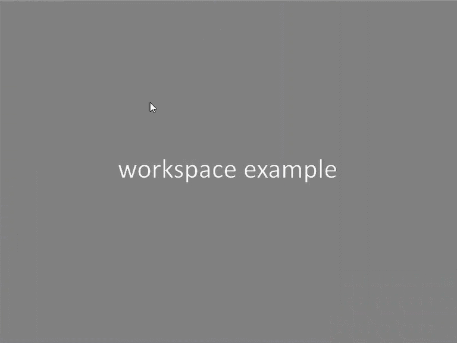

# PyQtExtendedScene

## Описание модуля

* **doc** - папка с описанием модуля.
* **examples** - папка с примерами.

* **PyQtExtendedScene** - папка с модулем.
    * **basecomponent.py** - файл с базовым классом **BaseComponent** для компонентов.
    * **componentgroup.py** - файл с классом **ComponentGroup** для составных компонентов.
    * **extendedscene.py** - файл с основным виджетом/сценой **ExtendedScene** для рисования компонентов.
    * **pointcomponent.py** - файл с классом **PointComponent** компонента, который представляет собой точку.
    * **rectcomponent.py** - файл с классом **RectComponent** компонента, который представляет собой прямоугольник.
    * **rubberband** - файл с классом **RubberBand** для отображения выделенного прямоугольника.
    * **scenemode.py** - файл с перечислением режимов **SceneMode**, в которых может находиться сцена.
    * **sender.py** - файл с вспомогательным классом для отправки Qt-сигналов. 
    * **utils.py** - файл с мелкими функциями.
* **scripts** - папка со скриптами для выпуска релиза.
* **tests** - тесты.

## Типы компонентов

В **PyQtExtendedScene** есть компоненты следующих типов:
* **PointComponent** - точка;
* **RectComponent** - прямоугольник;
* **ComponentGroup** - составной компонент.

Составной компонент может включать в себя прямоугольники и точки.

Компонентам можно задать следующие атрибуты, которые влияют на поведение компонентов в обычном режиме (о режимах работы написано ниже):

* **draggable** - компонент можно перемещать в обычном режиме;
* **selectable** - компонент можно выбирать в обычном режиме;
* **unique_selection** - компонент может быть выбран только единолично.

## Режимы

Виджет **ExtendedScene** может находиться в одном из режимов:
* **NORMAL** - обычный режим;
* **EDIT** - режим редактирования;
* **EDIT_GROUP** - режим редактирования составного компонента.

#### Общий функционал для всех режимов

Во всех режимах можно:

- Перетаскивать сцену зажатой **ЛЕВОЙ** кнопкой мышки.

  

- Зумировать сцену колесиком мышки.

  

- Выделять компонент кликом **ЛЕВОЙ** кнопки мышки.

- Выделять несколько компонентов кликом **ЛЕВОЙ** кнопки мышки с зажатой клавишей **Ctrl**.

  

- Копировать выделанные компоненты с помощью быстрых клавиш **Ctrl + C**.

- Вырезать выделенные компоненты с помощью быстрых клавиш **Ctrl + X**.

- Вставлять скопированные/вырезанные компоненты с помощью быстрых клавиш **Ctrl + V**.

  

- Удалять выделенные компоненты с помощью клавиши **Delete**.

  

#### Обычный режим

По умолчанию сцена находится в обычном режиме. Для перехода в обычный режим нужно вызвать метод:

```python
scene.set_scene_mode(SceneMode.NORMAL)
```

В обычном режиме можно:
* Выделять компоненты движением мышки с зажатой **ПРАВОЙ** кнопкой мышки.

  
  
* Можно задать режим, при котором выделенный зажатой правой кнопкой мышки прямоугольник останется видимым после того, как правая кнопка мышки будет освобождена. Для этого нужно вызвать метод:

  ```python
  scene.show_rubber_band_after_mouse_release()
  ```

  

  Можно ограничить выделенный прямоугольник только областью фонового изображения. Для этого нужно вызвать метод:

  ```python
  scene.limit_rubber_band_size_to_background(True)
  ```

  

  Чтобы вернуться к обычному режиму, при котором выделенный прямоугольник исчезает после освобождения правой кнопки мышки, нужно вызвать метод:

  ```python
  scene.hide_rubber_band_after_mouse_release()
  ```

По умолчанию все компоненты можно выделять и перетаскивать. Чтобы запретить выделение компонента в обычном режиме, при создании компонента нужно передать аргумент:

```python
component = Component(selectable=False)
```

Чтобы запретить перетаскивание компонента в обычном режиме, при создании компонента нужно передать аргумент:

```python
component = Component(draggable=False)
```

#### Режим редактирования

Для перехода в режим редактирования нужно вызвать метод:

```python
scene.set_scene_mode(SceneMode.EDIT)
```

В режиме редактирования можно:
* Рисовать точку кликом **ПРАВОЙ** кнопки мышки с нажатой клавишей **Shift**.

  

* Рисовать прямоугольник зажатой **ПРАВОЙ** кнопкой мышки.

  

* Перетаскивать точку, прямоугольник, составной компонент зажатой **ЛЕВОЙ** кнопкой мышки при наведении мышки внутрь соответствующего компонента. Если перетаскиваемые точка или прямоугольник находятся в составном компоненте, то составной компонент перетаскивается целиком.

  

* Изменять размеры прямоугольника, который не находится в составном компоненте. Для этого нужно навести мышку на границу прямоугольника и зажать **ЛЕВУЮ** кнопку мышки.

  

В режиме редактирования все компоненты, которые не являются частью составного компонента, могут выделяться и перетаскиваться.

#### Режим редактирования составного компонента

Для перехода в режим редактирования составного компонента нужно выделить составной компонент и вызвать метод:

```python
scene.set_scene_mode(SceneMode.EDIT_GROUP)
```

Если при переходе в этот режим не был выделен составной компонент либо были выделены несколько составных компонентов, то будет создан новый (пустой) составной компонент.

В режиме редактирования составного компонента можно:

* Рисовать точку кликом **ПРАВОЙ** кнопки с нажатой клавишей **Shift**.
* Рисовать прямоугольник зажатой **ПРАВОЙ** кнопкой мышки.
* Перетаскивать точку, прямоугольник, находящиеся внутри составного компонента. Для этого нужно навести мышку внутрь точки/прямоугольника и зажать **ЛЕВУЮ** кнопку мышки.
* Изменять размеры прямоугольника, который находится внутри составного компонента. Для этого нужно навести мышку на границу прямоугольника и зажать **ЛЕВУЮ** кнопку мышки.

Все созданные точки/прямоугольники будут включены в состав нового составного компонента. Например, если скопировать составной компонент, а потом в режиме **EDIT_GROUP** произвести вставку, то все части скопированного составного компонента окажутся в составе редактируемого составного компонента.


